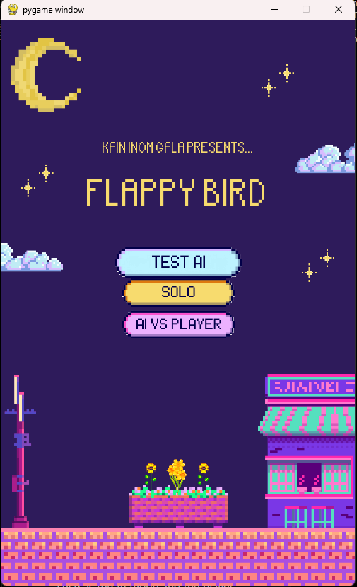

# Flappy Bird - A Flappy Bird Clone with a NEAT AI

This is a simple clone of the popular mobile game Flappy Bird, made using the Pygame library. The game is controlled by a NEAT AI, which is a genetic algorithm that evolves a population of neural networks to play the game.
<div style="display:flex; justify-content:center;">
    
    <!-- Add other images sa susunod -->
</div>


## Installation
Execute the following command to install the required packages:
```bash
pip install -r requirements.txt
```
NOTE: Use a python virtual environment to avoid conflicts with other packages.

## Requirements
- Python 3.6 or higher
- Pygame 2.0.1 or higher
- NEAT-Python 0.92 or higher
- Other package could be added once we reach the AI features

## Usage
To run the game, execute the following command:
```bash
python main.py
```

## Folder Structure
### [assets/](assets/) Folder
Contains all the assets used in the game, such as images and sounds.

- [**character/**](assets/character/) - Contains the images of the characters divided by the name of the character as folder.

- [**map/**](assets/map/) - Contains the images of the maps divided by the name of the map as folder.

- [**menu/**](assets/menu/) - Contains the images of the menu divided by the name of the menu as folder.

- [**fonts/**](assets/fonts/) - Contains the fonts used in the game. We use **retrofix** font for the game.

### [flappy_bird/](flappy_bird/) Folder
Contains the objects used in the game. Includes the behavior of the bird, the pipes, and the base.
- [**abstracts.py**](flappy_bird/abstracts.py) - Contains the abstract classes for the game objects.

- [**characters.py**](flappy_bird/characters.py) - Contains the characters used in the game. This is where you configure the characters.

- [**objects.py**](flappy_bird/objects.py) - Contains the game objects, such as the character, the pipes, and the floor.

- [**maps.py**](flappy_bird/maps.py) - Contains the maps used in the game. This is where you configure the maps content.

### [game/](game/) Folder
Contains the main game loop and the game logic. Some of the configurations are also present in this folder.

It is divided into the following files:

- [**menu.py**](game/menu.py) - Contains the menu screen and character selection logic. Including holding the selection of the user.

- [**environment.py**](game/environment.py) - Contains the game environment and the game loop, including the handling of the map and character.

- [**modes.py**](game/modes.py) - Contains the game modes, such as the AI mode and the player mode.

## Main File
### [main.py](main.py)
Contains the driver code for the game. It initializes the game and runs the main game loop.

## Missing Features
Below is a list of features that are missing from the game:
- [ ] Score functionality
- [ ] Test AI -- The AI training
- [ ] Game Over Screen
- [ ] Pause functionality
- [ ] Character Selection
- [ ] AI vs. Player mode

Note: Cchanges might be applied as we progress in the development of the game.